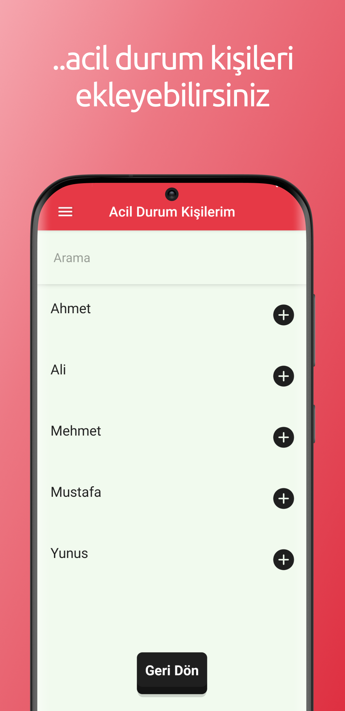

# Liddl - Son Depremler ve Acil SMS

### Stack: React Native

### React Native öğrenirken geliştirdiğim 1. uygulama. (android)

### Google Play Store

#### https://play.google.com/store/apps/details?id=com.liddl_sosapp

##$ Screenshot

